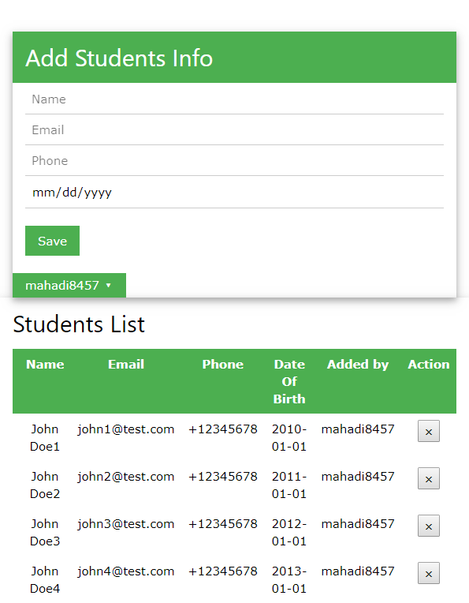
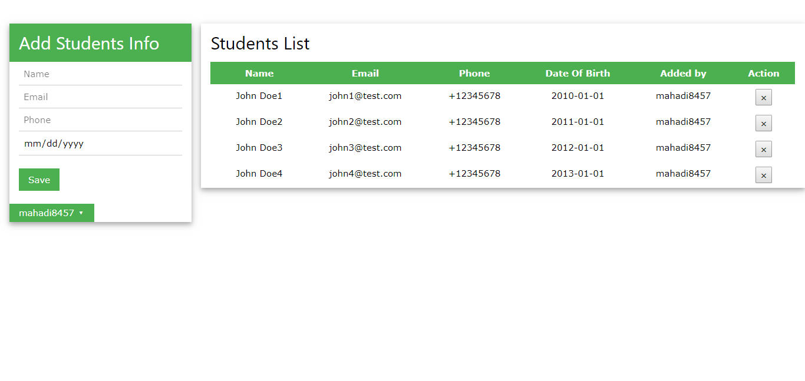

# Simple Students List

The Meteor app.

Use it to Save a student’s list for your Tuition. 
The list updates on everyone's screen in real time.

Learn how to build this app by following the [Meteor Tutorial] (http://www.meteor.com/install).
Read more about building apps with Meteor in the [Meteor Guide] (http://guide.meteor.com).

